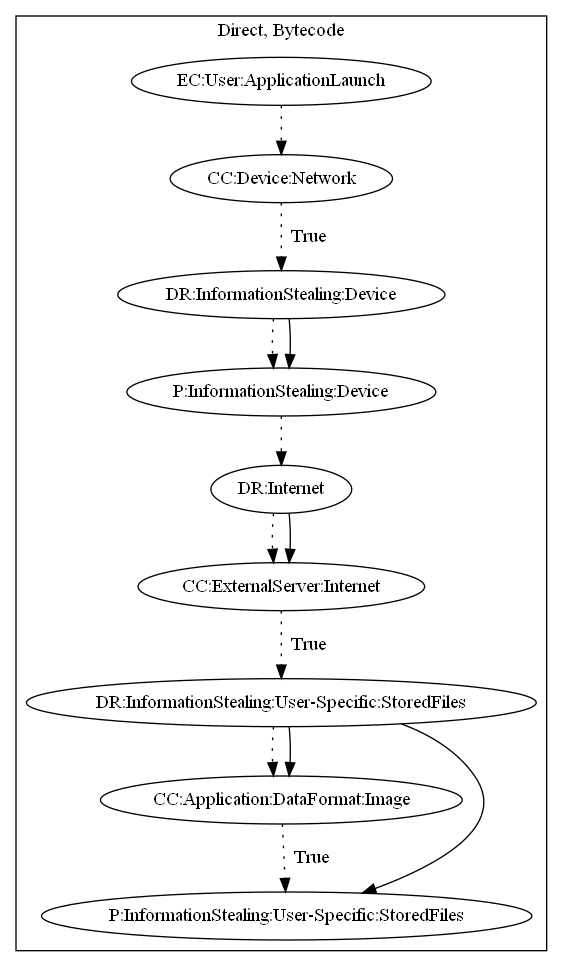

# BeaverGang

## High-level Description

* Year: 2016
* File Hash (SHA-256): a707cb76e566321c08b8ba8f5c89cb0cf41125468366f5b8fdad8c6fa526deb4
* Blog: https://nakedsecurity.sophos.com/2016/06/30/beaver-gang-counter-malware-ejected-from-play-store/

This malware sample aims to steal stored files on the users device. Device information is initially sent to the malware developers server when there is network connection on application launch. The malware sample retrieves commands as a response, and looks for image files within the device. Any images found are sent to the malware developers server.

## Signature
---

The image of the signature can be downloaded [here](../../img/signatures/BeaverGang.png) for closer inspection.

