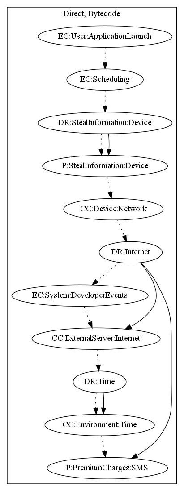

# BKotlindHRX

## High-level Description

* Year: 2018
* File Hash (SHA-256): 621092856e20e628a577dbe9248649eae78d1af611d9168635b22057c6c7552b
* Blog: https://blog.trendmicro.com/trendlabs-security-intelligence/first-kotlin-developed-malicious-app-signs-users-premium-sms-services/, https://blog.malwarebytes.com/cybercrime/mobile/2018/02/mobile-menace-monday-first-kotlin-developed-malicious-app/

This malware sample aims to load a payload which performs premium charges based on WAP Billing. On launch of the application, the sample leaks device information (e.g., Device ID) to the server. It then checks the network connectivity of the device, and retrieves from the server a payload with commands. Lastly, the app checks whether a certain amount of time has passed before sending text messages to perform premium charges.

## Signature
---

The image of the signature can be downloaded [here](../../img/signatures/BKotlindHRX.png) for closer inspection.

