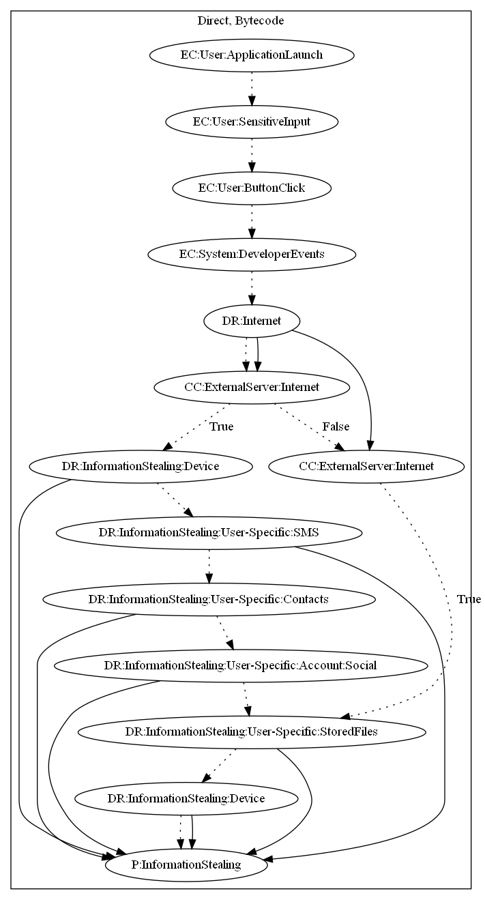

# ChatSpyA

## High-level Description

* Year: 2017
* File Hash (SHA-256): 6c009275d952cc6ec5d9d41fc9d7a47a31813483b768291c5c01e54a83787ca9
* Blog: https://blog.trendmicro.com/trendlabs-security-intelligence/deciphering-confucius-cyberespionage-operations/

This malware sample aims to steal user-specific information from the user. The user logs into the application by performing a series of sensitive input and button clicks. The malware sample uses firebase cloud messaging services to retrieve two commands. The first command (right side of graph) aims to leak stored files on the device to the malware developer's server. The second command (left side of graph) aims to leak contacts, device information, social accounts, and stored files to the malware developer's server.

## Signature
---

The image of the signature can be downloaded [here](../../img/signatures/ChatSpyA.png) for closer inspection.

