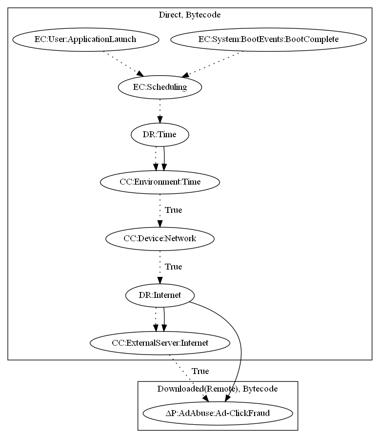

# ClickrAd

## High-level Description
* Year: 2018
* File Hash (SHA-256): bf986d22532c83668f6772b2748c8e528f265ea1d26ee107ae1b87355bf3bcae
* Blog: https://nakedsecurity.sophos.com/2018/12/10/android-click-fraud-apps-mimic-apple-iphones-to-boost-revenue/

This malware application aims to perform ad-click fraud. The malware sample implements an alarm that periodically runs on application launch and when the device boots. The sample retrieves commands and a malicious executable based on the malware developer's C&C server. The malicious executable then performs ad-click fraud (an observed behavior) as a result.

## Signature
---

The image of the signature can be downloaded [here](../../img/signatures/ClickrAd.png) for closer inspection.

