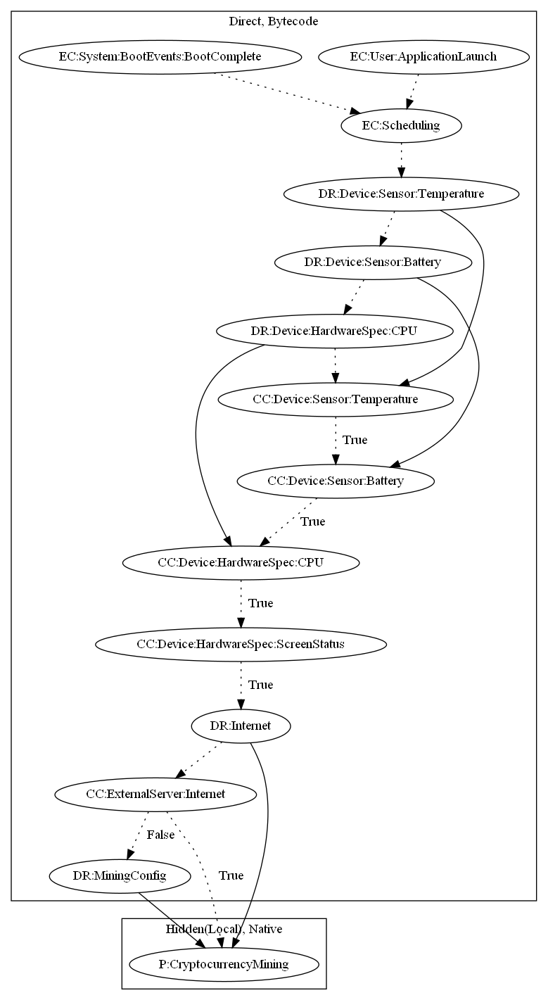

# CPUMiner

## High-level Description

* Year: 2017
* File Hash (SHA-256): d3c0bed627edab9ac1bbc2bcc6e8c3ff45b4708afa527790e42a4a6fe2c045f0
* Blog: https://blog.trendmicro.com/trendlabs-security-intelligence/coin-miner-mobile-malware-returns-hits-google-play/

This malware application aims to mine cryptocurrency. The malware schedules an alarm when the application launches or device boots up. If the battery, temperature, and CPU are below a threshold, the malware sample starts mining procedures natively.

## Signature
---

The image of the signature can be downloaded [here](../../img/signatures/CPUMiner.png) for closer inspection.

