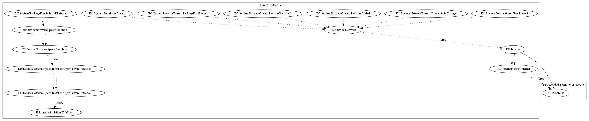

# DroidPlugin

## High-level Description

* Year: 2017
* File Hash (SHA-256): 5467ebe255bd59912c61aa1b801ea93972672885bfa29c3ee9756342ceb65228
* Blog: https://unit42.paloaltonetworks.com/unit42-new-trend-android-adware-abusing-android-plugin-frameworks/

This malware sample abuses virtualization technologies to install applications for monetary gain. The malware sample collects commands to download additional APK files on various package events (Package First Launch, Package Added, Package Replaced), network events (Connectivity Change), and device status events (User Present). The malware developer gains monetary value as a referrer of the installed app. In addition, the sample hides its icon when the device is not a sandbox environment. 

## Signature
---

The image of the signature can be downloaded [here](../../img/signatures/DroidPlugin.png) for closer inspection.

