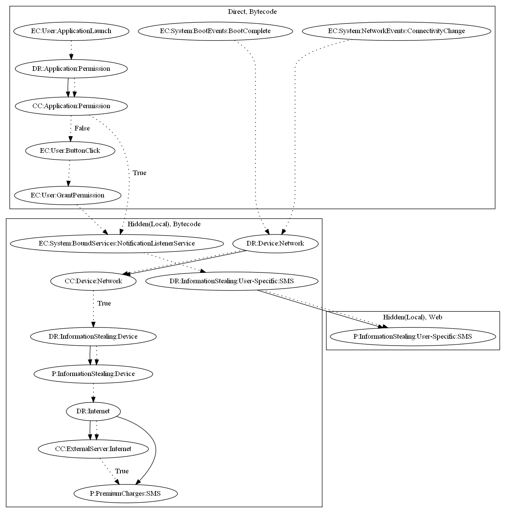

# Etinu

## High-level Description

* Year: 2021
* File Hash (SHA-256): 08c4f705d5a7c9dc7c05edee3fcad12f345a6ee6832d54b758e57394292ba651
* Blog: https://www.mcafee.com/blogs/other-blogs/mcafee-labs/clever-billing-fraud-applications-on-google-play-etinu/?hilite=%27google%27%2C%27malicious%27

This malware sample attempts to perform premium charges and steal SMS messages. The malware decrypts and loads a local payload upon boot complete and connectivity change which contacts the malware developers server and registers the device to premium charges. On application launch, it requests for notification listener services and loads a local payload that attempts to intercept SMS messages to further confirm the premium charge.

## Signature
---

The image of the signature can be downloaded [here](../../img/signatures/Etinu.png) for closer inspection.

