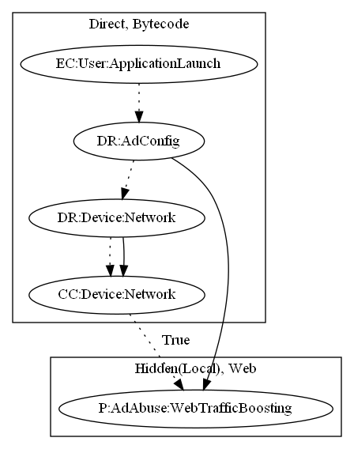

# FakeAppCQ

## High-level Description

* Year: 2016
* File Hash (SHA-256): 83c3bfd939befb14723efd2aba24cb9cd9783aad0e104484e0f4fb6a4ed0a656
* Blog: https://www.welivesecurity.com/2016/07/15/pokemon-go-hype-first-lockscreen-tries-catch-trend/

This malware application aims to open up web pages based on local configuration. The browser displays random websites, aiming to perform web traffic boosting.

## Signature
---

The image of the signature can be downloaded [here](../../img/signatures/FakeAppCQ.png) for closer inspection.

