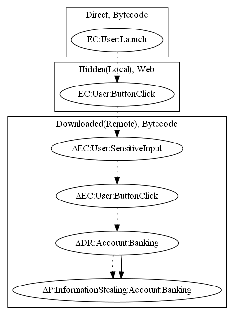

# FakeFlash

## High-level Description

* Year: 2017
* File Hash (SHA-256): 559e8016ffd7fae2203446cb8ea724a5561f50c42230be18828394a65cfa9cf0
* Blog: https://www.welivesecurity.com/2017/04/04/dont-pay-free-malicious-adobe-flash-player-app-found-google-play/

This malware application opens scam links to steal information from the user. On launch of the application, the sample loads a local web file to persuade the user that flashplayer is out of date. It then provides a link that the user can visit to "update flashplayer". The link opens a scam page, which the malware developer steals the user's sensitive information from.

## Signature
---

The image of the signature can be downloaded [here](../../img/signatures/FakeFlash.png) for closer inspection.

