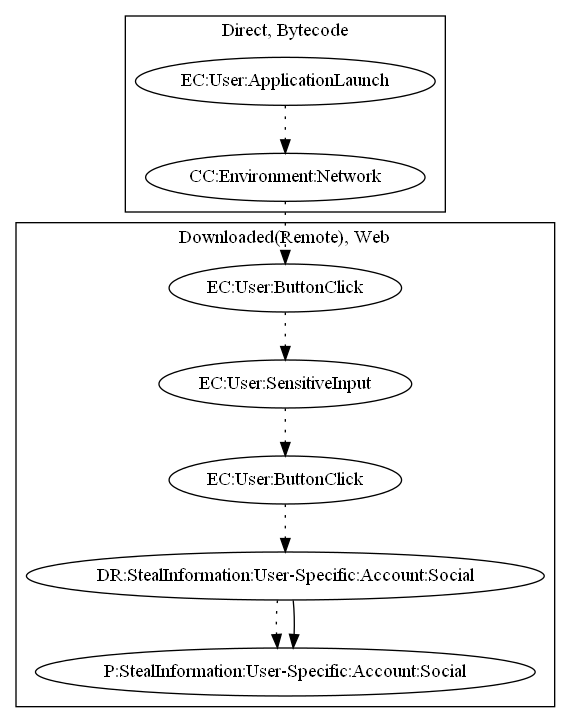

# FakeInsta

## High-level Description

* Year: 2019
* File Hash (SHA-256): 4c299a84230a432232b0bb2df25b293c18cf2ed419fb6f62623b9b89b8181df9
* Blog: https://blog.malwarebytes.com/cybercrime/2019/04/instagram-password-stealing-apps-found-on-google-play/

This malware application opens a fake instagram login page to phish social account credentials from the user. On launch of the application, the sample opens a web page to the user. Once the user presses a button to login, it provides a fake phishing page. When the user enters sensitive information and presses the login button, the sample leaks their credentials to the malware developer.

## Signature
---

The image of the signature can be downloaded [here](../../img/signatures/FakeInsta.png) for closer inspection.

