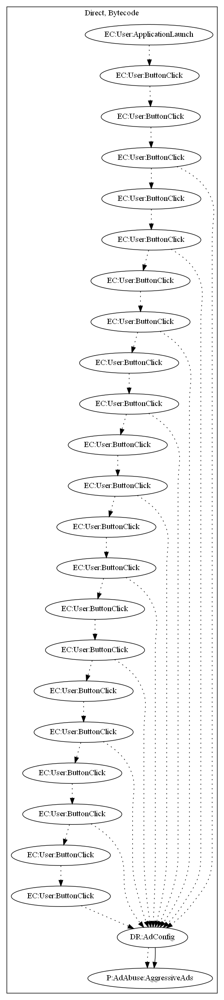

# FakeWhatsApp

## High-level Description

* Year: 2018
* File Hash (SHA-256): 3b76aad2a56f16b0ae674bc90d5e5cb7e70c216c8e76a56f3b333c991ad3ada7
* Blog: https://www.welivesecurity.com/2018/02/28/cryptocurrency-scams-android/

This malware application acts as a set of tutorial slides to show how to install WhatsApp. When the user clicks on a tutorial page and clicks out of the page, ads are annoyingly displayed to the user.

## Signature
---

The image of the signature can be downloaded [here](../../img/signatures/FakeWhatsApp.png) for closer inspection.

