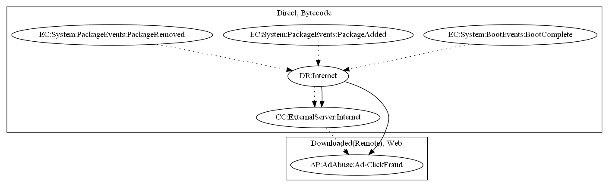

# Fakeyouwon

## High-level Description

* Year: 2019
* File Hash (SHA-256): 734363b849d289e23d385b8c1d3490f5a20f9a3baee890973fb645d4586cd6e4
* Blog: https://symantec-enterprise-blogs.security.com/blogs/threat-intelligence/unofficial-telegram-app-malicious-sites

This malware sample aims to perform ad-click fraud. The malware sample retrieves commands and a malicious executable on package events (Package Removed, Package Added) and boot events (Boot Complete). The malware sample then opens a webview and performs fraudulent clicks for ad revenue. 

## Signature
---

The image of the signature can be downloaded [here](../../img/signatures/Fakeyouwon.png) for closer inspection.

