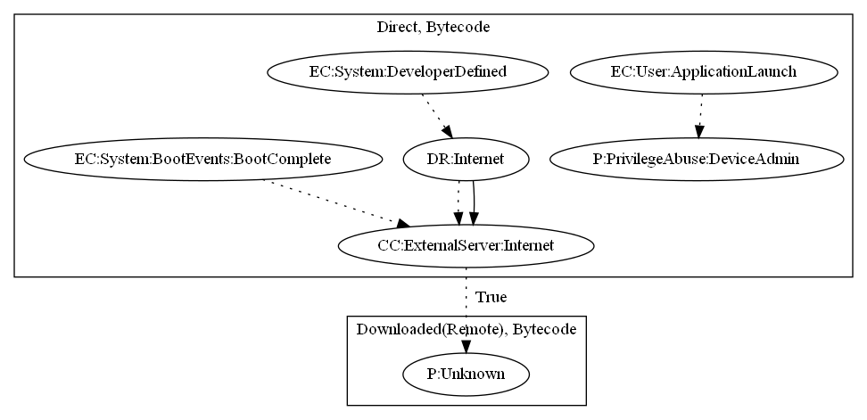

# FalseGuide

## High-level Description

* Year: 2017
* File Hash (SHA-256): dab6e89b5c75cf2e2ce4a6fc6c11024a669a2c0979970f7fa9e787858f6e1033
* Blog: https://blog.checkpoint.com/2017/04/24/falaseguide-misleads-users-googleplay/

This malware sample aims to perform privilege abuse, and run an unknown payload. Device admin privileges are requested upon launching the application. The app further retrieves commands from Firebase messaging services to download a payload. It then runs the payload on boot complete or after receiving the message.

## Signature
---

The image of the signature can be downloaded [here](../../img/signatures/FalseGuide.png) for closer inspection.

