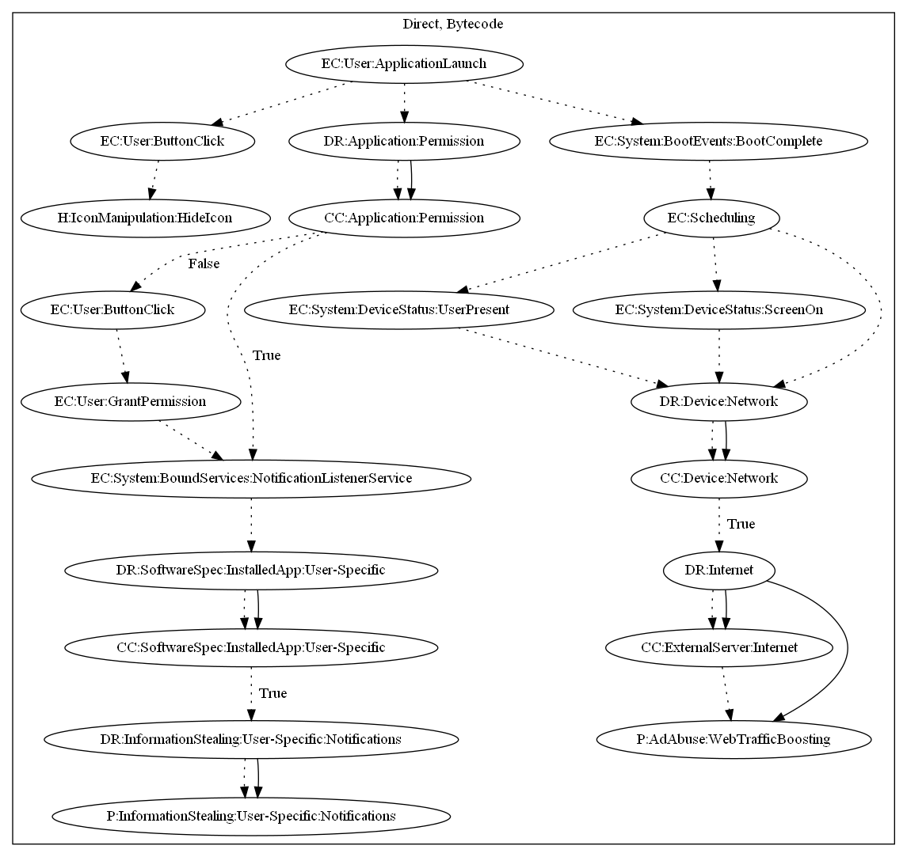

# FlixOnline

## High-level Description

* Year: 2021
* File Hash (SHA-256): e80456610b62240723717f7e29fc3f4ad96f17215f09f14a3eb3351c944aecbb
* Blog: https://blog.checkpoint.com/2021/04/07/autoreply-attack-new-android-malware-found-in-google-play-store-spreads-via-malicious-auto-replies-to-whatsapp-messages/, https://research.checkpoint.com/2021/new-wormable-android-malware-spreads-by-creating-auto-replies-to-messages-in-whatsapp/, https://blogs.blackberry.com/en/2021/04/threat-thursday-flixonline-fake-application-masquerades-as-netflix-app

This malware sample aims to perform ad abuse and steal whatsapp messages. It requests notification listener service permissions on launching the application. The app then retrieves Whatsapp messages based on intercepting notifications, and leaks the information to the malware developers server. Additionally, the malware contains capabilities to display websites upon screen status. Lastly, it hides the app icon upon the user closing the app (i.e, pressing the back button via button click).

## Signature
---

The image of the signature can be downloaded [here](../../img/signatures/FlixOnline.png) for closer inspection.

