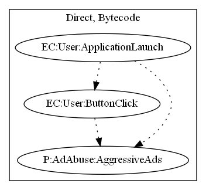

# FraudApp

## High-level Description

* Year: 2018
* File Hash (SHA-256): e5da7d1517ceca781edb750bd3042e5e0f66d7773fe256b5802e6c13f5db34e0
* Blog: https://www.welivesecurity.com/2018/02/28/cryptocurrency-scams-android/

This malware application acts as a fake ripple miner. Ads are continually pushed to the user based on button interactions based on the user.

## Signature
---

The image of the signature can be downloaded [here](../../img/signatures/FraudApp.png) for closer inspection.

