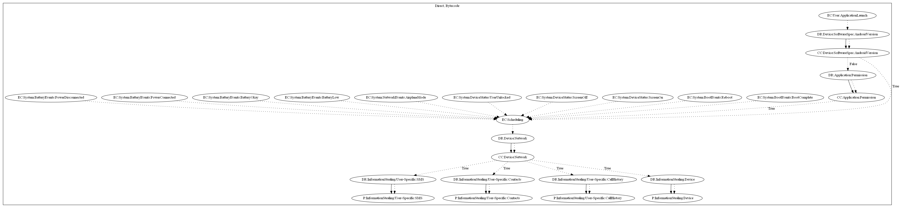

# GravityRAT

## High-level Description

* Year: 2020
* File Hash (SHA-256): c39270febb9097def21777c994d10738ba2a915c88f516fb1e896e5d7240cc0d
* Blog: https://securelist.com/gravityrat-the-spy-returns/99097/

This malware sample aims to leak information of the user. It listens on a wide variety of system-wide events (boot complete, reboot, screen on/off, user unlocked, airplane mode, battery low/okay, power connect/disconnect) and periodically checks whether the network is available. It then collects SMS, contacts, call logs, and device information and leaks it to the malware developers server.

## Signature
---

The image of the signature can be downloaded [here](../../img/signatures/GravityRAT.png) for closer inspection.

