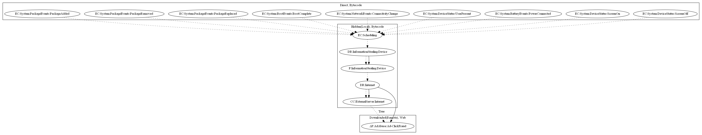

# GuerillaD

## High-level Description

* Year: 2018
* File Hash (SHA-256): e3c340b73646348115cc387f793a9cf3677a089423d07b6ab9ddc17bea6232f3
* Blog: https://nakedsecurity.sophos.com/2018/05/10/watch-out-photo-editor-apps-hiding-malware-on-google-play/

This malware sample aims to perform ad-click fraud. It listens to a variety of package events (Package Added, Package Removed, Package Replaced), boot events (Boot Complete), device status (User Present, Screen On, Screen Off), and battery events (Power Connected). The malware sample schedules a task to steal device information and retrieve ad configuration to perform ad-click fraud.

## Signature
---

The image of the signature can be downloaded [here](../../img/signatures/GuerillaD.png) for closer inspection.

