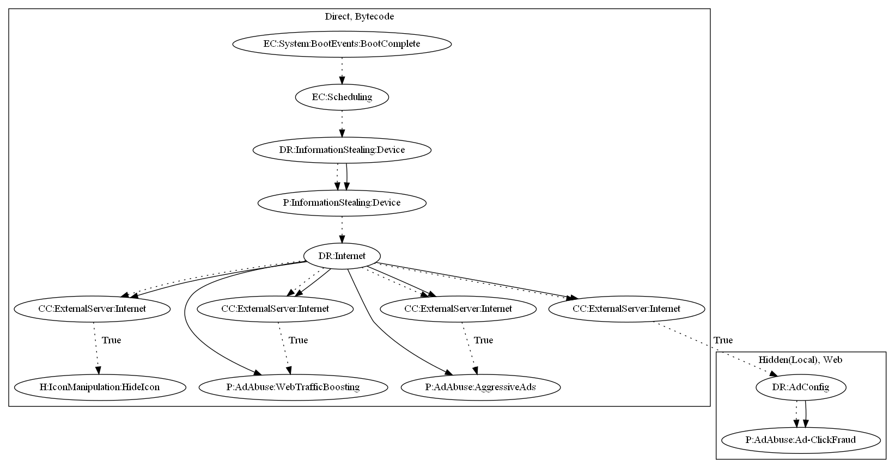

# HiddadAJN

## High-level Description

* Year: 2020
* File Hash (SHA-256): 74595648e4e71110cd4d4376ffab7007d3dc0bea999c201aa7c05d17da1b59a7
* Blog: https://www.welivesecurity.com/2020/05/11/breaking-news-app-promises-news-brings-ddos-attacks/

This malware sample aims to perform a variety of ad abuse payloads. The malware schedules an alarm on boot complete to contact the malware developers server. Upon receiving commands, the malware can: (1) hide the app icon, (2) load a local web file to perform ad click fraud, (3) open a URL to perform web traffic boosting, and (4) push full screen ads to the user.

## Signature
---

The image of the signature can be downloaded [here](../../img/signatures/HiddadAJN.png) for closer inspection.

