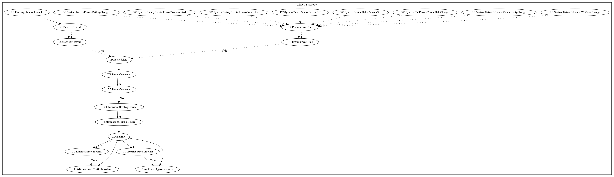

# HiddenAdHRXJA

## High-level Description

* Year: 2020
* File Hash (SHA-256): 1953b665cf16800345d995b2454a19cd6a253d792804abc568d2391cf5165028
* Blog: https://www.trendmicro.com/en_us/research/20/f/barcode-reader-apps-on-google-play-found-using-new-ad-fraud-technique.html

This malware aims to perform ad abuse payloads. Starting from application launch or a variety of system-wide events (wifi state change, connectivity change, screen on, screen off, etc.), it waits a set period of time before checking the network and contacting the malware developers server. It then receives commands periodically from the server to either: (1) perform web traffic boosting, or (2) push full screen ads to the user.

## Signature
---

The image of the signature can be downloaded [here](../../img/signatures/HiddenAdHRXJA.png) for closer inspection.

