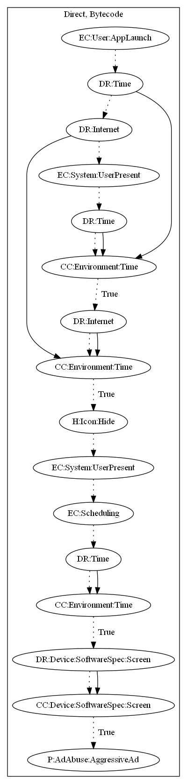

# HidenAdHRXH

## High-level Description

* Year: 2019
* File Hash (SHA-256): 776b0a9e5d06a239579ea758c76db46dc0fcd5662bc8d257ed97ec9af5a1b844
* Blog: https://www.trendmicro.com/en_us/research/19/h/adware-posing-as-85-photography-and-gaming-apps-on-google-play-installed-over-8-million-times.html

This malware application aims to aggressively push full screen ads to the user. The malware contains two time bombs based on the current system time and configuration from the malware developer's server. The app then hides its icon and registers a receiver on device status system events (i.e., on device unlock). Lastly, the sample displays an ad average another time check. An alarm repeats the ad displaying routine.

## Signature
---

The image of the signature can be downloaded [here](../../img/signatures/HidenAdHRHX.png) for closer inspection.

