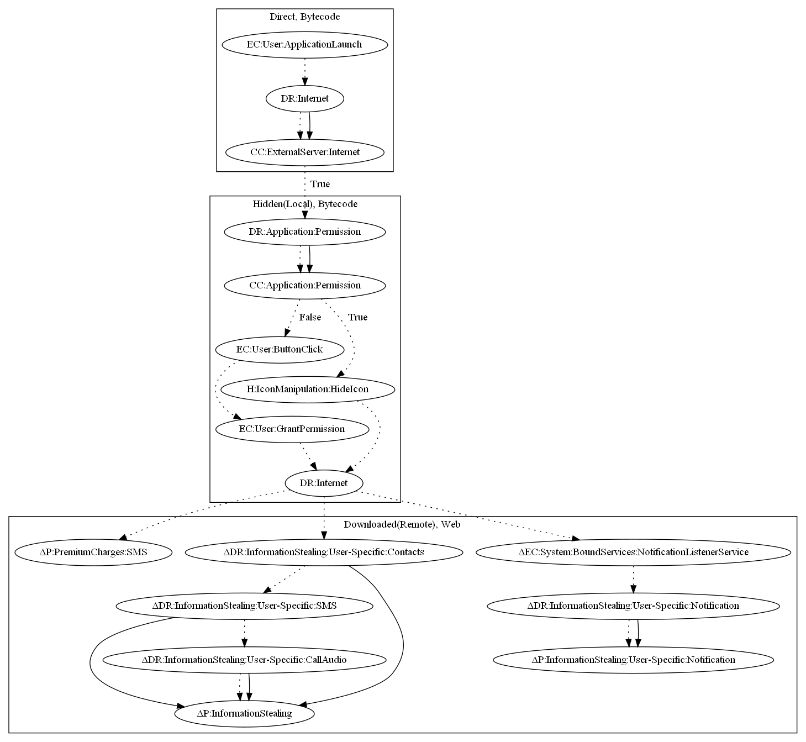

# JokerV2

## High-level Description

* Year: 2020
* File Hash (SHA-256): db43287d1a5ed249c4376ff6eb4a5ae65c63ceade7100229555aebf4a13cebf7
* Blog: https://research.checkpoint.com/2020/new-joker-variant-hits-google-play-with-an-old-trick/

This malware attempts to download an additional payload which performs premium subscriptions and steals various user information. The malware first contacts the malware developers server, and loads a local payload within the Android manifest upon a valid response. It then requests notification listener services permissions and hides the app icon upon granting the permission. It then downloads a payload remotely and uses reflection to invoke the payload. The blog describes that the payload can: (1) perform premium charges, (2) steal contact, SMS, and call audio, and (3) steal notifications based on the notification listener class (all observed behaviors).

## Signature
---

The image of the signature can be downloaded [here](../../img/signatures/JokerV2.png) for closer inspection.

