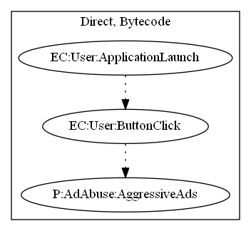

# Livestream

## High-level Description

* Year: 2018
* File Hash (SHA-256): cd54b8c70f245763ae3b60b213ae84f18404ce1723283067604edb4c0b77fdb7
* Blog: https://blog.malwarebytes.com/cybercrime/2018/03/mobile-menace-monday-olympics-app-has-more-ads-than-games/

This malware application acts as a live stream video feed. When the user attempts to open the live stream video feed, they are annoyingly pushed ads.

## Signature
---

The image of the signature can be downloaded [here](../../img/signatures/Livestream.png) for closer inspection.

