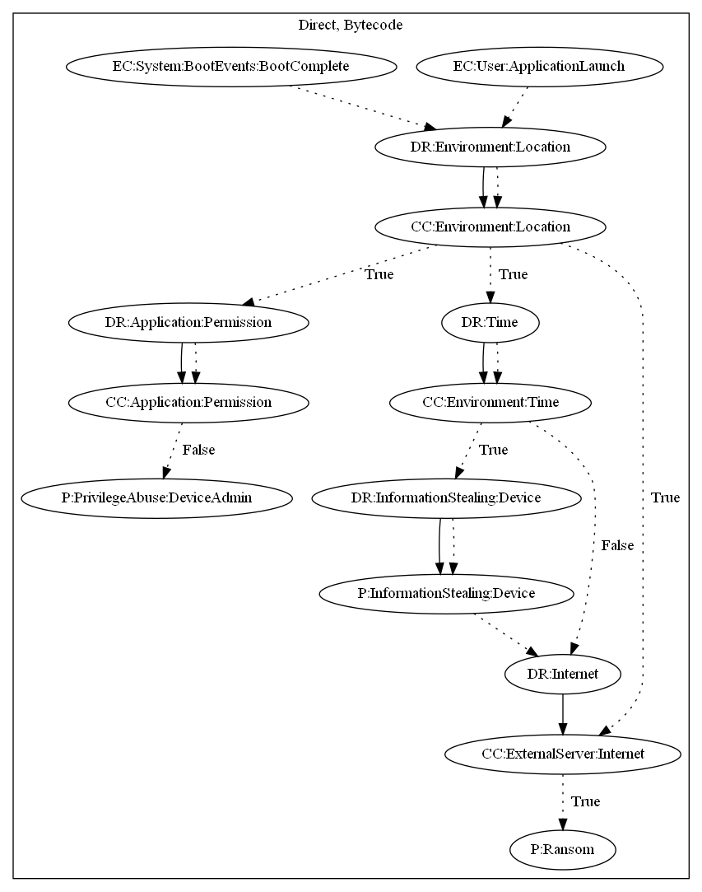

# PletorD

## High-level Description

* Year: 2017
* File Hash (SHA-256): b3df6aa17e513685c8873bf021bd00ee5e8a74be5028bbd29b73062f2318baac 
* Blog: https://securelist.com/mobile-malware-evolution-2016/77681/, https://securelist.com/it-threat-evolution-q3-2016-statistics/76513/

This malware sample aims to perform ransom. The malware checks to ensure the user is in a specific location on boot complete and application launch. It then performs two tasks: (1) requests device admin permissions if not already available, (2) retrieves a command from the C&C server to lock the device into silent mode.

## Signature
---

The image of the signature can be downloaded [here](../../img/signatures/PletorD.png) for closer inspection.

