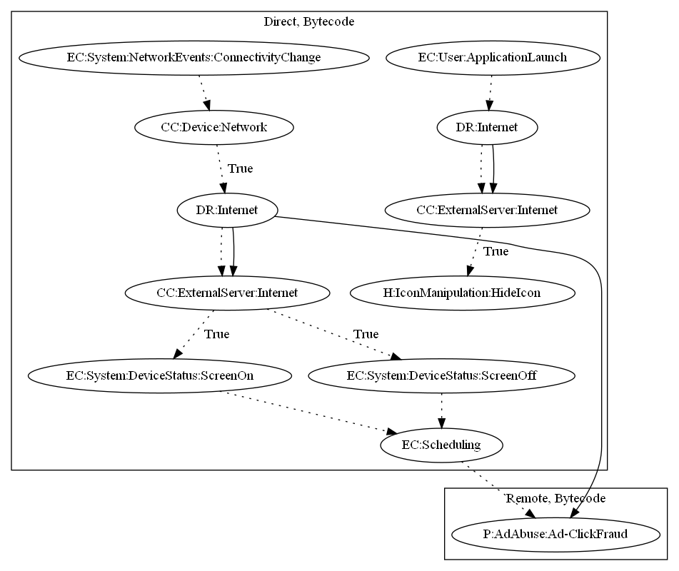

# PornClicker

## High-level Description

* Year: 2016
* File Hash (SHA-256): 7db2584bcba77e2b7e2de53b7025728eb0fab5f2ae2d3bed744fde50f27e16ac
* Blog: https://www.welivesecurity.com/2016/02/24/porn-clicker-trojans-google-play-analysis/

This malware sample aims to perform ad-click fraud. The malware retrieves commands and ad configuration from it's C&C server to register a broadcast receiver on screen on/off system-wide events. These events then schedule tasks used to perform ad-click fraud. This sample also has the ability to hide it's icon on application launch based on response from it's C&C server. 

## Signature
---

The image of the signature can be downloaded [here](../../img/signatures/PornClicker.png) for closer inspection.

