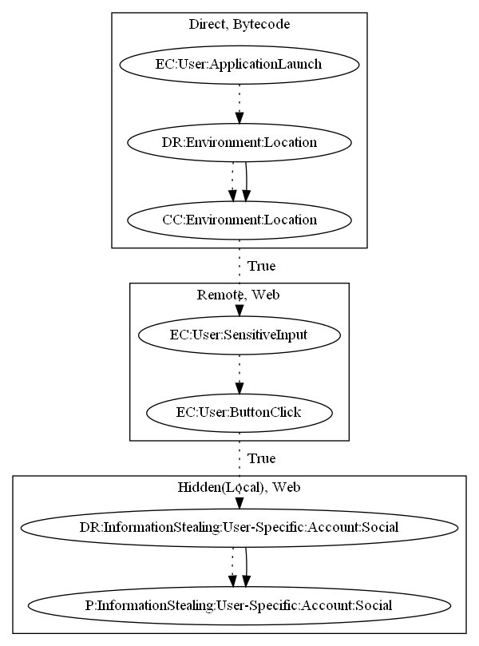

# PSWAndroidOSMyVk

## High-level Description

* Year: 2017
* File Hash (SHA-256): 76fabb56d9d69031b7fefcdd365c4a4d866d3c417976121a63e8336d29b6128d
* Blog: https://securelist.com/still-stealing/83343/

This malware sample aims to steal VK credentials from the user. The malware sample checks that the user is from a specific region of the world (i.e., Russia or Ukraine). It then opens the legitimate VK website. A local javascript payload collects users credential on login.

## Signature
---

The image of the signature can be downloaded [here](../../img/signatures/PSWAndroidOSMyVk.png) for closer inspection.

