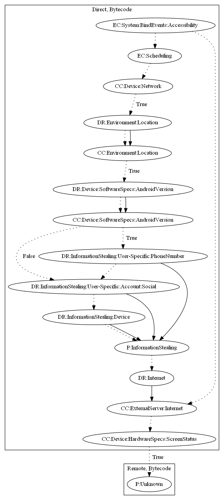

# RedDawn

## High-level Description

* Year: 2018
* File Hash (SHA-256): 24be606a3d946b2d4ee01399e6fe89593125eb7fd848e37767e7f5aeb28c734a
* Blog: https://securingtomorrow.mcafee.com/other-blogs/mcafee-labs/malware-on-google-play-targets-north-korean-defectors/

This malware sample aims to steal information and perform an unknown payload. It schedules a task that repeats on accessibility events. It then aims to steal device and user-specific information (ex., phone number, social accounts) from the user. Lastly, it retrieves a command and executable from the server and executes an unknown payload when the screen is off.

## Signature
---

The image of the signature can be downloaded [here](../../img/signatures/RedDawn.png) for closer inspection.

