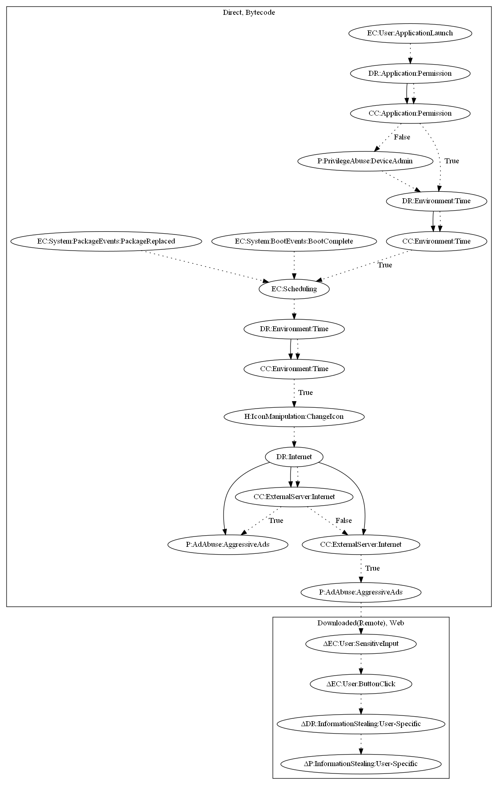

# Reputation1

## High-level Description

* Year: 2018
* File Hash (SHA-256): 50641bcc05d0c625190c3ff8e4f6b0b5e0cf82893c35cf6b130444ab4d192b2a 
* Blog: https://www.symantec.com/blogs/threat-intelligence/persistent-malicious-apps-google-play

This malware sample aims to display full screen ads to the user and steal user-specific information. The malware first requests device admin privileges on launching the application. It then registers a routine that periodically collects commands from the server. The command can be one of the following: (1) display full screen ads, (2) open a scam link to retrieve user-specific information.

## Signature
---

The image of the signature can be downloaded [here](../../img/signatures/Reputation1.png) for closer inspection.

