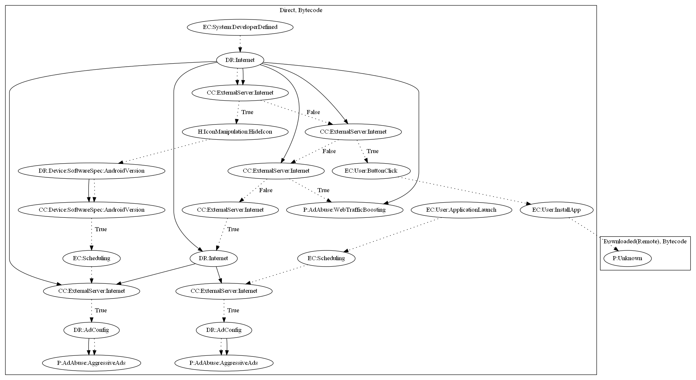

# SimBad

## High-level Description

* Year: 2019
* File Hash (SHA-256): d69f91b43cb489f2913eeb3a891493c36f61eb2eab55c32e9dd578c8bb152070
* Blog: https://research.checkpoint.com/2019/simbad-a-rogue-adware-campaign-on-google-play/

This malware aims to perform ad abuse payloads. The malware retrieves commands based on Parse push notifications which can: (1) hide the app icon and push full screen ads (requires settings to enable ads based on another command), (2) enable pushing full screen ads to the user, (3) display web pages to the user, (4) launch the app store to install additional apps with unknown payloads.

## Signature
---

The image of the signature can be downloaded [here](../../img/signatures/SimBad.png) for closer inspection.

