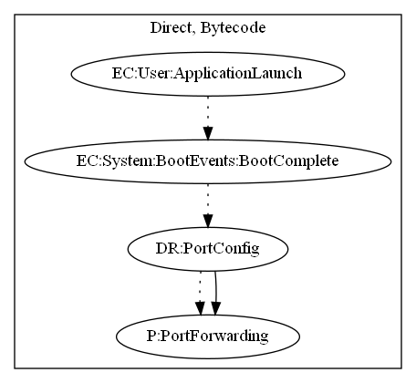

# SocksBotA

## High-level Description

* Year: 2016
* File Hash (SHA-256): 8bf26e48359ae61e8870c241a00b3a709cfd4a0dc385eccbc16305746b18f64d
* Blog: https://blog.trendmicro.com/trendlabs-security-intelligence/dresscode-potential-impact-enterprises/

This malware application aims to create a port for the malware developer to access the users internal network. The sample registers a broadcast receiver that listens to boot events (Boot Complete) when the application launches. The malware then reads port configuration and opens a port to the malware developers domain.

## Signature
---

The image of the signature can be downloaded [here](../../img/signatures/SocksBotA.png) for closer inspection.

