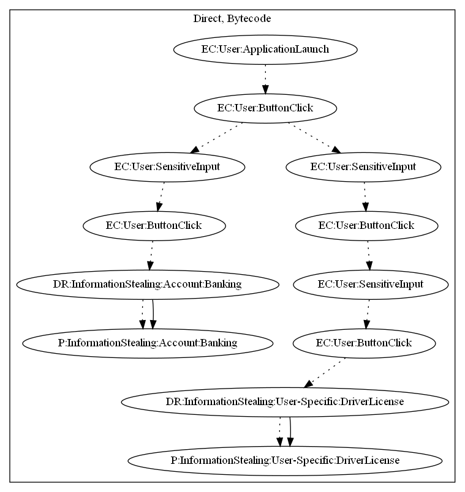

# SpyBankerAIF

## High-level Description

* Year: 2018
* File Hash (SHA-256): 1e5160a0b9ac22ef344ce70ae0dbeb7e3e90e23859a1aec91f104a0534e8d37d
* Blog: https://www.welivesecurity.com/2018/09/19/fake-finance-apps-google-play-target-around-world/

This malware sample acts as a fake banking application. Upon launch, the user can click two buttons: (1) register, (2) login. The sample steals banking information from the user upon the registation page. When logging in, the app requests the user to "verify" themselves by inputting personal information (i.e., driver license, phone number, and age). This information is also sent to the malware developers server.

## Signature
---

The image of the signature can be downloaded [here](../../img/signatures/SpyBankerAIF.png) for closer inspection.

