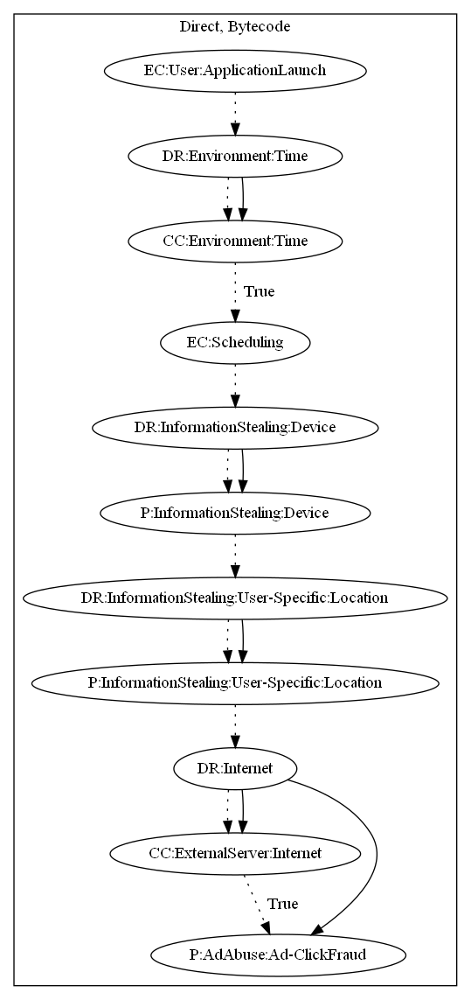

# TrojanClicker

## High-level Description

* Year: 2018
* File Hash (SHA-256): d34598835b28a6ad070dd0986b0bbc336c8ba7cac9a9a22d6b3c6a99049242a6
* Blog: https://blog.trendmicro.com/trendlabs-security-intelligence/android-wallpaper-apps-found-running-ad-fraud-scheme/

This malware sample aims to perform ad-click fraud. The malware sample waits a period of time before scheduling a routine on application launch. It then steals device and location information from the user. Commands and ad configuration are sent to the sample from the malware developer's server to perform ad-click fraud.

## Signature
---

The image of the signature can be downloaded [here](../../img/signatures/TrojanClicker.png) for closer inspection.

