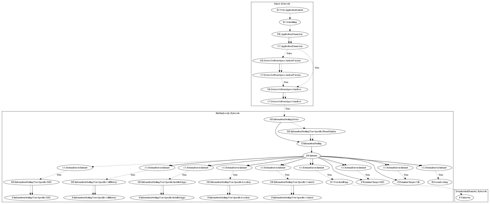

# TrojanDropperAgentCIQ

## High-level Description

* Year: 2018
* File Hash (SHA-256): 60d582edc382269bb6b26a5bbd9e45b560849be528425751e530a548677e3d61
* Blog: https://www.welivesecurity.com/2018/10/24/banking-trojans-continue-surface-google-play/

This malware sample aims to steal a wide variety of user-specific information from the user, perform premium charges, and perform additional unknown payloads. The malware sample sends device information and the users phone number to the malware developers server after checking whether the device is an emulator. It then retrieves commands which can perform: (1) steal SMS messages, (2) steal the users call history, (3) steal installed app information on the device, (4) steal location information, (5) steal contact information, (6) perform premium SMS or call charges, (7) lock the device screen.

## Signature
---

The image of the signature can be downloaded [here](../../img/signatures/TrojanDropperAgentCIQ.png) for closer inspection.

