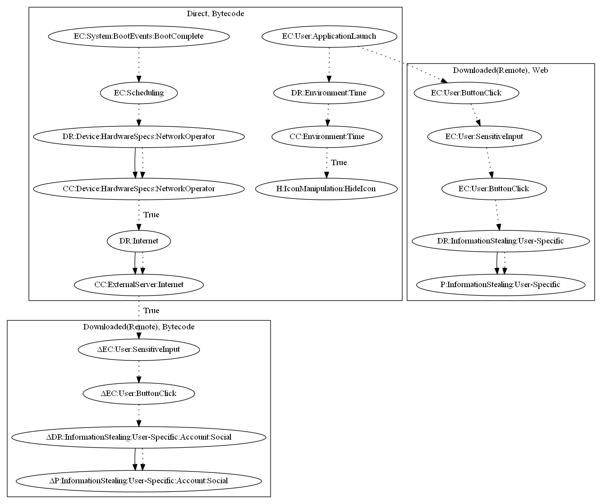

# TrojanAgentDropperGY

## High-level Description

* Year: 2016
* File Hash (SHA-256): 942577573d432c06c77250b7ee70133de8820d923b7ec6f91241b34a464ecfc1
* Blog: https://www.welivesecurity.com/2016/08/03/fake-prisma-apps-found-google-play/

This malware sample aims to steal user information. The malware sample schedules a task that checks the current network operator of the device. It also retrieves commands and an executable that opens a login page to steal the user's social account. In addition to stealing social accounts, the malware sample opens scam links on application launch. User-specific information entered witin the scam link is sent to the malware developer.

## Signature
---

The image of the signature can be downloaded [here](../../img/signatures/TrojanDropperAgentGY.png) for closer inspection.

