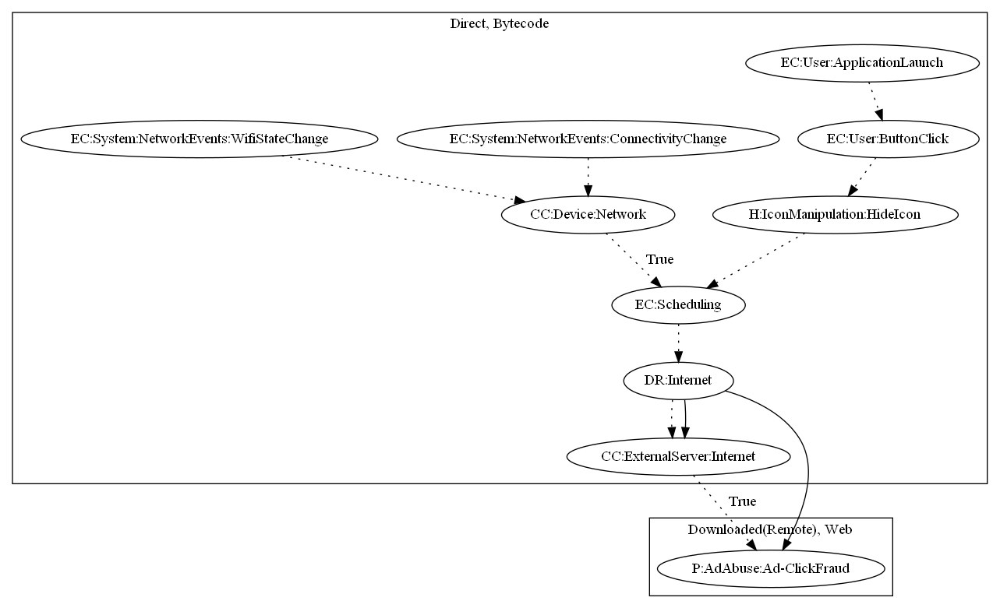

# TrojanPornClicker

## High-level Description

* Year: 2016
* File Hash (SHA-256): 6b40366ca8a153c900671778171544d3dd30f08a7c7e354e6f363a084b3bb8b9
* Blog: https://blog.malwarebytes.com/cybercrime/2016/06/trojan-clickers-gaze-cast-upon-google-play-store/

This malware sample aims to perform ad-click fraud. It schedules a repeating task on network related events (Wifi State Change, Connectivity Change). It then retrieves ad configuration and commands from the malware developer's server to perform ad-click fraud. This malware sample also contains the ability to hide it's app icon on application launch based on a button click from the user.

## Signature
---

The image of the signature can be downloaded [here](../../img/signatures/TrojanPornClicker.png) for closer inspection.

