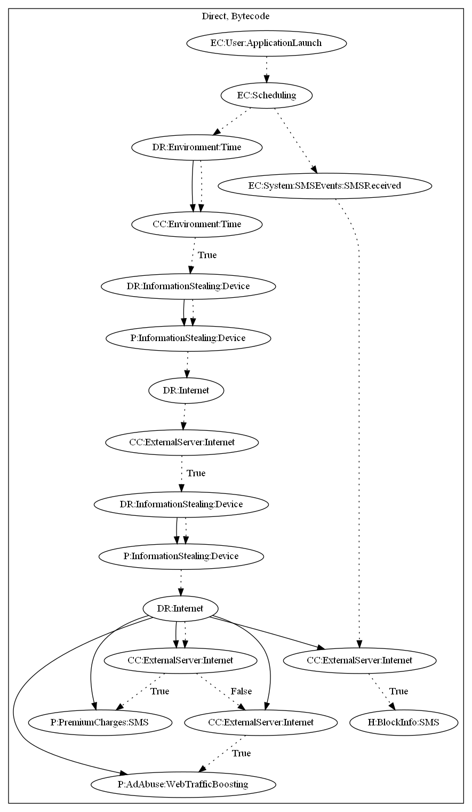

# ZtorgA

## High-level Description

* Year: 2017
* File Hash (SHA-256): 062f765081b2962b2e1bb1bad698ccec04dd2d986321b6a69a8ee787b370fa38
* Blog: https://securelist.com/ztorg-from-rooting-to-sms/78775/

This malware sample perform premium charges or web traffic boosting. The malware sample schedules a repeating task on application launch. This task performs two tasks. The first task retrieves commands from the malware developer's server to perform premium charges, or open web pages to perform web traffic boosting. The second task triggers when the user receives an SMS message. It then can block incoming SMS messages depending on the command sent from the first task.

## Signature
---

The image of the signature can be downloaded [here](../../img/signatures/ZtorgA.png) for closer inspection.

